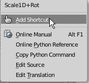

> [in English](./readme.md)

---

# Scale1D+Rot

> ビューの向きに依存した形でメッシュのスケールと回転を行う

## インストール

1. `mesh_scale1d_rot.py` をダウンロード
-  `Blender User Preference` > `Install from File`  から `mesh_scale1d_rot.py` を選択
-  適当にショートカットキーをアサインしてください

   (ツールシェルフにあるパネルの`Scake1D+Rot`ボタンを右クリックで簡単にショートカットキーを設定できます)

   
   

## 使い方

1. Edit Mesh モードでメッシュを選択
-  ショートカットキーから `Scale1D+Rot` を実行した後、

   - マウスカーソル移動： 選択メッシュのスケールと回転を同時に行う

   - Altキー + マウス移動： スケールする軸を変更する

   - Shift + マウス移動： 回転せずにスケールのみ行う

-  クリックで決定
