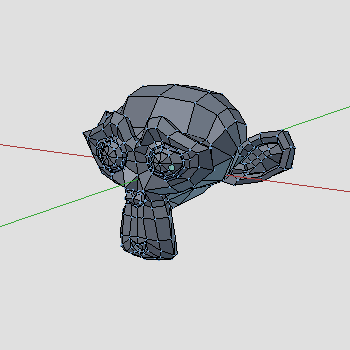
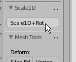
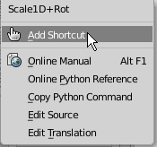

> [日本語](./readme-jp.md)

---

# Scale1D+Rot

> For Mesh Edit -- Quick viewport based Scale & Rotate

## Installation

1. Download `mesh_scale1d_rot.py`
-  `Blender User Preference` > `Install from File` > Select `mesh_scale1d_rot.py`
-  Assign shortcut key as you like

   *Hint:* You can easily assign a shortcut key through the `Right-click` menu over the button in the Tool Shelf:

   
   

## Usage

1. Select meshes in Mesh-Edit Mode
-  Invoke `Scale1D+Rot` by shortcut key

   - Mouse Move: `Scale+Rot` Mode.

   - Alt + Mouse Move: `Change Scale Axis` Mode.

   - Shift + Mouse Move: `Scale Only` Mode.

-  Click to exit
